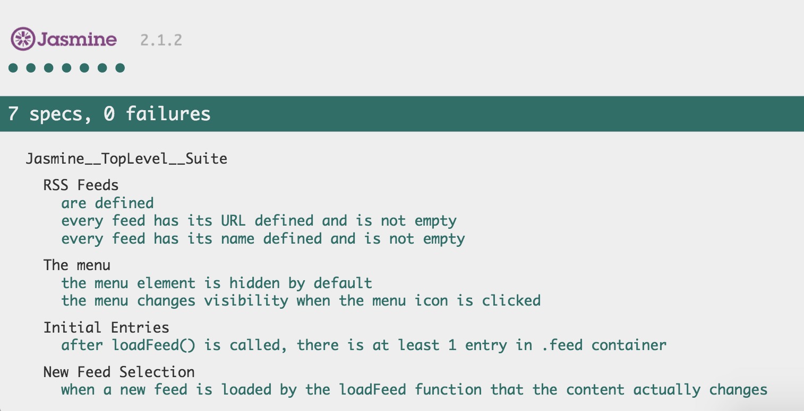

## Introduction

This project is to test the integrity of the Feed Reader web app. The test code is implemented thourgh [Jasmine](https://jasmine.github.io). The main function of the web app is to retreive feeding contents asyncronously according to users' preferences through Google API.

## Test Specs

There are 4 categorized test specs in the project. For more infomation, please refer to the following screenshot and the source code in `jasmine/spec/feedreader.js`.

## Run the Project
Open `index.html` in browser to run the project. The latest Google Chrome is recommended.

## Attribution

The starter code is provided by [Udacity Front End Nanodgree Team](https://github.com/udacity/frontend-nanodegree-feedreader). Refer to the original repository for more details.

## Contribution

All pull request are welcome.
